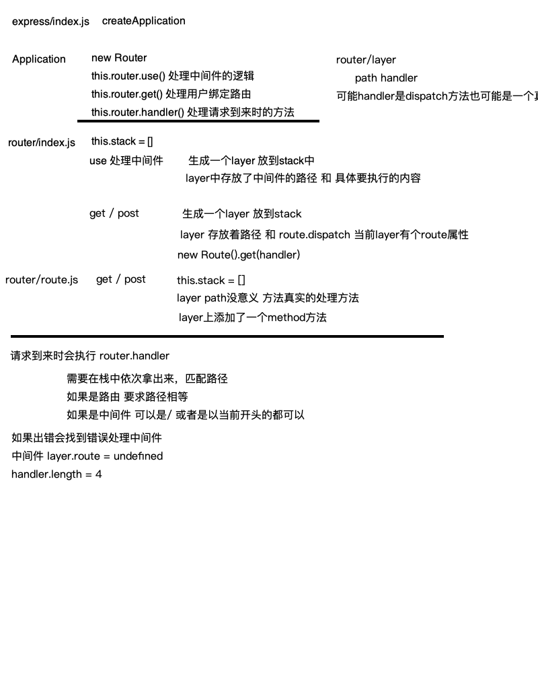
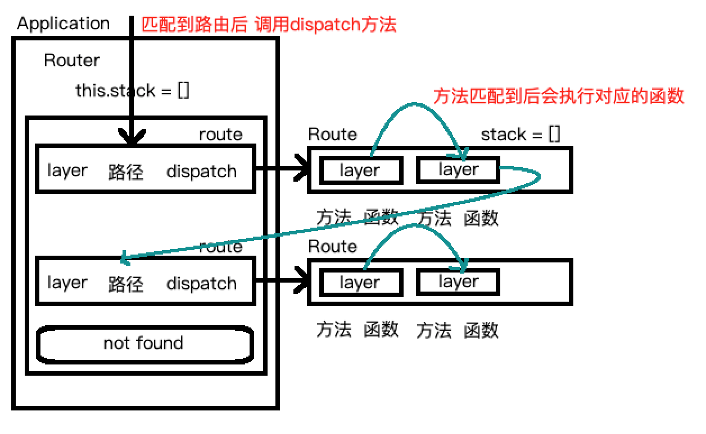
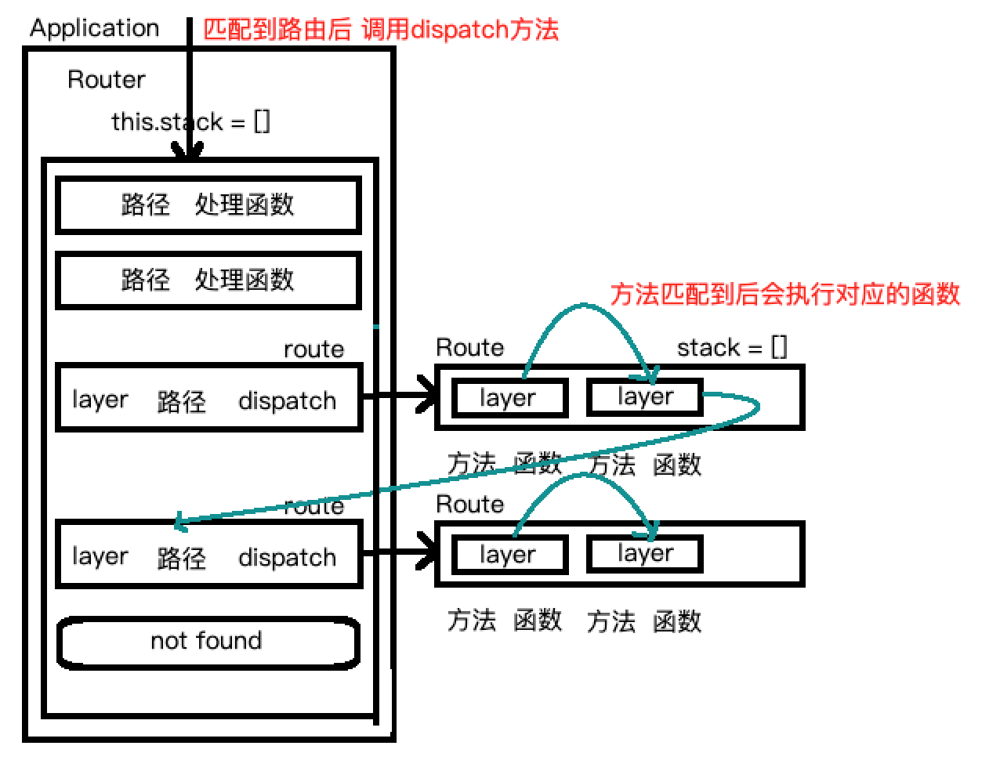

# Express应用+原理
## 一.创建express服务

```javascript
let express = require('./express');
let app = express();
// 最基本的模型
app.get('/',function(req,res){
	res.end('ok');
});
app.listen(3000);
```



## 二.路径匹配

```javascript
let http = require("http");
let url = require("url");
let routers = [ // 404路由
  {
    path: "*",
    method: "*",
    handler(req, res) {
      res.end(`Cannot ${req.method} ${req.url}`);
    }
  }
];
function createApplication() {
  return {
    get(path, handler) {
      routers.push({
        path,
        method: "get",
        handler
      });
    },
    listen() {
      let server = http.createServer((req, res) => {
        let { pathname } = url.parse(req.url);
        for (let i = 1; i < routers.length; i++) {
          let { path, method, handler } = routers[i];
          if (path === pathname && method == req.method.toLocaleLowerCase()) {
            return handler(req, res);
          }
        }
        return routers[0].handler(req, res);
      });
      server.listen(...arguments);
    }
  };
}
module.exports = createApplication;
```

## 三.分离应用

```javascript
let http = require('http');
let url = require('url');
function Application(){
    this._router = [
        {path:'*',method:'*',handler(req,res){
            res.end(`Cannot ${req.method} ${req.url}`)
        }}
    ]
}
Application.prototype.get = function(path,handler){
    this._router.push({
        path,
        handler,
        method:'get'
    })
}
Application.prototype.listen = function(){
    let server = http.createServer((req,res)=>{
        let {pathname} = url.parse(req.url);
        for(let i = 1;i<this._router.length;i++){
            let {path,method,handler} = this._router[i];
            if (path === pathname && method == req.method.toLocaleLowerCase()){
                return handler(req, res);
            }
        }
        return this._router[0].handler(req,res);
    });
    server.listen(...arguments);
}
module.exports = Application;
```



## 四.应用和路由的分离

```javascript
let http = require("http");
let Router = require('../router');
function Application() {
  this._router = new Router();
}
Application.prototype.get = function(path, handler) {
  // 交给路由系统来存储
  this._router.get(path,handler);
};
Application.prototype.listen = function() {
  let server = http.createServer((req, res) => {
    function done(){ // 内部处理不了结束响应
        res.end(`Cannot ${req.method} ${req.url}`);
    }
    // 交给路由系统处理
    this._router.handle(req,res,done);
  });
  server.listen(...arguments);
};
module.exports = Application;
```

## 五.路由系统

```javascript
let Layer = require('./layer');
let Route = require('./route');
function Router(){
    this.stack = [];
}
Router.prototype.route = function(path){
    // 做layer 和 route之间的关系
    let route = new Route();
    let layer = new Layer(path,route.dispatch.bind(route)); // 将路径存储到layer中
    layer.route = route;
    this.stack.push(layer);
    return route;
}
// 创建 Route 将handler传入到route中
Router.prototype.get = function(path,handler){
    let route = this.route(path); // 将路径存入layer中
    route.get(handler);// 将handler存入到route中
}
Router.prototype.handle = function(req,res,done){
    
}
```

## 六.Route类

```javascript a
let Layer = require('./layer')
function Route(){
    this.stack = []
}
Route.prototype.get = function(handler){
    let layer = new Layer('/',handler);
    layer.method = 'get';
    this.stack.push(layer);
}
Route.prototype.dispatch = function(){
    
}
module.exports = Route;
```

## 七.Layer类

```javascript
function Layer(path,handler){
    this.path = path;
    this.handler = handler;
}
module.exports = Layer;
```

## 八.当请求到来时

```javascript
Router.prototype.handle = function(req,res,out){
    let {pathname} = url.parse(req.url);
    let idx = 0;
    let next = () => {
        if(idx>= this.stack.length) return out(); // 匹配不到调用not found
        let layer = this.stack[idx++];
        if(layer.match(pathname)){ // 如果路径匹配到了 调用route的dispatch方法
            layer.handle_request(req,res,next);
        }else{
            next(); // 匹配不到找下一层
        }
    }
    next();
}
```

## 九.Layer中新增匹配方法并调用内部dispatch逻辑

```javascript
function Layer(path,handler){
    this.path = path;
    this.handler = handler;
}
// 匹配路由
Layer.prototype.match = function(pathname){
    return this.path == pathname
}
Layer.prototype.handle_request = function(req,res,next){
    // 调用dispatch方法
    this.handler(req,res,next);
}
module.exports = Layer;
```

```javascript
Route.prototype.dispatch = function(req,res,out){
    let idx = 0;
    let next = () =>{
        if(idx>=this.stack.length) return out();
        let layer = this.stack[idx++];
        // 如果方法匹配打牌了
        if(layer.method === req.method.toLowerCase()){
            layer.handle_request(req,res,next); // 内部匹配完了在出来
        }else{
            next();
        }
    }
    next();
}
```

---

## 十.优化

路由懒加载

```javascript
Application.prototype.lazy_route = function(){ // 路由懒加载
    if(!this._router){
        this._router = new Router();
    }
}
```

批量生成方法

```javascript
methods.forEach(method=>{
    Application.prototype[method] = function(path, handler) {
        // 交给路由系统来存储
        this.lazy_route();
        this._router[method](path,handler);
      };
});
```

```javascript
methods.forEach(method => {
    Router.prototype[method] = function(path,handler){
        let route = this.route(path); // 将路径存入layer中
        route[method](handler);// 将handler存入到route中
    }
});
```

```javascript
methods.forEach(method=>{
    Route.prototype[method] = function(handler){
        let layer = new Layer('/',handler);
        layer.method = method;
        this.stack.push(layer);
    }
})
```

多个方法链式调用

```javascript
Application.prototype[method] = function(path, ...handlers) { 
        // 交给路由系统来存储
        this.lazy_route();
        this._router[method](path,handlers);
};
```

```javascript

Route.prototype[method] = function(handlers){
  handlers.forEach(handler=>{
    let layer = new Layer('/',handler);
    layer.method = method;
    this.stack.push(layer);
  })
}
```

加速匹配

```javascript
function Route(){
    this.stack = [];
    this.methods = {};
}
methods.forEach(method=>{
    Route.prototype[method] = function(handlers){
        handlers.forEach(handler=>{
            let layer = new Layer('/',handler);
            layer.method = method;
            this.methods[method] = true;
            this.stack.push(layer);
        })
    }
})
```

```javascript
if(layer.route.methods[req.method.toLowerCase()]){
	layer.handle_request(req, res, next);
}
```


## 十一.中间件的应用

```javascript
let express = require('./express');
let app = express();
// 最基本的模型
app.use(function(req,res,next){
    console.log('middle 1');
    next();
});
app.use(function(req,res,next){
    console.log('middle 2');
    res.end('root');
})
app.use('/hello',function(req,res,next){
    res.end('hello');
})
app.listen(3000);
```



增加use方法

```javascript
// 中间件
Application.prototype.use = function(){
    this.lazy_route();
    this._router.use(...arguments); // 交给路由处理
}
```

```javascript
Router.prototype.use = function(path,handler){
    if(typeof handler !== 'function'){
        handler = path;
        path = '/'
    }
    let layer = new Layer(path,handler);
    layer.route = undefined;
    this.stack.push(layer); // 将当前层放到stack中
}   
```

当请求到来时,区分是中间件还是路由,如果是中间件直接执行即可

```javascript
let next = () => {
    if (idx >= this.stack.length) return out(); // 匹配不到调用not found
    let layer = this.stack[idx++];
    // 如果匹配到
    if (layer.match(pathname)) {
      if (!layer.route) { // 中间件
        layer.handle_request(req,res,next);
      } else { // 路由
        if(layer.route.methods[req.method.toLowerCase()]){
            layer.handle_request(req, res, next);
        }else{
            next();
        }
      }
    } else {
      next(); // 匹配不到找下一层
    }
  };
```

```javascript
Layer.prototype.match = function(pathname){
    if(this.path === pathname){
        return true
    }
    if(!this.route){ // 如果是中间件
        if(this.path === '/'){
            return true;
        }
        return pathname.startsWith(this.path+'/');
    }
    return false;
}
```

## 十二.错误中间件

```javascript
Route.prototype.dispatch = function(req,res,out){
    let idx = 0;
    let next = (err) =>{
        if(err) return out(err); // 有错误就抛出去
        if(idx>=this.stack.length) return out();
        let layer = this.stack[idx++];
        // 如果方法匹配打牌了
        if(layer.method === req.method.toLowerCase()){
            layer.handle_request(req,res,next); // 内部匹配完了在出来
        }else{
            next();
        }
    }
    next();
}
```

```javascript
let next = err => {
    if (idx >= this.stack.length) return out(); // 匹配不到调用not found
    let layer = this.stack[idx++];
    if (err) { // 有错误
        if(!layer.route){ // 如果是中间件
            layer.handle_error(err,req,res,next);
        }else{
            next(err); 
        }
    } else {
      // 如果匹配到
      if (layer.match(pathname)) {
        if (!layer.route) {
          // 中间件
          layer.handle_request(req, res, next);
        } else {
          // 路由
          if (layer.route.method === req.method.toLowerCase()) {
            layer.handle_request(req, res, next);
          } else {
            next();
          }
        }
      } else {
        next(); // 匹配不到找下一层
      }
    }
  };
```

处理错误

```javascript
Layer.prototype.handle_error = function(err,req,res,next){
    if(this.handler.length === 4){ // 参数是四个就是错误中间件
        return this.handler(err,req,res,next);
    }
    next(err);
}
```

## 十三.二级路由实现

测试用例

```javascript
let express = require('./express');
let app = express();
let router = express.Router();
router.get('/add',function(req,res,next){
    res.end('添加');
})
router.post('/remove',function(req,res,next){
    res.end('删除')
})
app.use('/user',router);
app.listen(3000);
```

express.Router()实现

```javascript
Application.Router = Router;

function Router() {
  let router =  function(req,res,next){
    router.handle(req,res,next);
  }
  router.stack = [];
  router.__proto__ = proto;
  return router;
}

// 调用get 时可能不是一个数组
methods.forEach(method => {
    proto[method] = function(path, handlers) {
    if(!Array.isArray(handlers)){
        handlers = Array.from(arguments).slice(1);
    }
    let route = this.route(path); // 将路径存入layer中
    route[method](handlers); // 将handler存入到route中
  };
});
```

## 十四.路由正则匹配

```javascript
app.get('/name/:id/:age',function(req,res,next){
    console.log(req.params);
    res.end('end');
})
```


```javascript
let pathToRegExp = require('path-to-regexp');
function Layer(path,handler){
    this.path = path;
    this.handler = handler;
    this.regExp = pathToRegExp(this.path,this.keys = [],true);
}

Layer.prototype.match = function(pathname){ 
    if(this.path === pathname){
        return true;
    }
    if(this.route){
        let matches = pathname.match(this.regExp);
        if(matches){ // 正则路由匹配
            let values = matches.slice(1);
            this.params = values.reduce((memo,current,index)=>{
                memo[this.keys[index].name] = values[index];
                return memo
            },{});
            return true
        }
    }
    if(!this.route){ // 中间件
        if(pathname === '/'){
            return true
        }
        return pathname.startsWith(this.path+'/');
    }
    return false
}
```

## 十五.带参数的路由

```javascript
app.param('id',function(req,res,next,value,key){ // 订阅事件
    console.log('id'+1);
    next();
});
app.param('id',function(req,res,next,value,key){
    console.log('id'+2);
    next();
});
app.get('/name/:id/:age',function(req,res,next){
    console.log(req.params);
    res.end('end');
});
```

```javascript
Application.prototype.param = function(key,callback){
    this.lazy_route();
    this._router.param(key,callback)
}

proto.param = function(key,callback){
    if(this.paramsCallbacks[key]){
        this.paramsCallbacks[key].push(callback)
    }else{
        this.paramsCallbacks[key] = [callback];
    }
}
```


```javascript
proto.handle_params = function(layer, req, res, done) {
  let keys = layer.keys; // [{name:id},{name:name}]
  if (!keys) {
    return done();
  }
  keys = keys.map(item => item.name);
  let idx = 0;
  let key;
  let fns;
  let next = () => {
    if (keys.length === idx) return done();
    key = keys[idx++];
    fns = proto.paramsCallbacks[key];
    if (fns && fns.length) {
      callbackParam();
    } else {
      next();
    }
  };
  let i = 0;
  let callbackParam = () => {
    // [fn,fn]
    let fn = fns[i++];
    if (fn) {
      fn(req, res, callbackParam, layer.params[key], key);
    } else {
      i = 0;
      next();
    }
  };
  next();
};

// 处理好param后触发对应的回调
proto.handle_params(layer, req, res, () => {
    layer.handler(req, res, next);
});
```