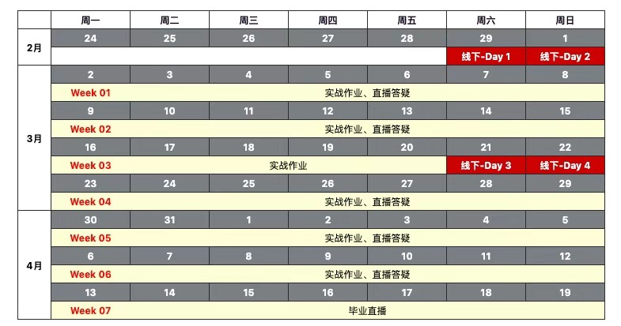

# 第一部分  Python进阶语法与高级数据模型
---
**实战案例：爬取 B 站弹幕和豆瓣影评、书评**

在第一天的课程中，你将掌握开发一个简单爬虫的基本技巧，并通过自定义 Python 内置的数据类型方法以及 collections、namedtuple 等数据模块优化爬虫的运行效率。

然后，你将使用学到的装饰器、面向对象和异常处理等知识对代码进行重构，学会编写结构优良的代码。

另外，我们也会涉及到对 requests 库的使用以及一些简单的数据库操作，在这个过程中，你还将对 HTTP 和数据库的基础知识有一定的了解。
## 学习目标：
能够使用常见网络库编写简单的爬虫。
掌握 Python 高阶语法及其底层原理。
掌握几种经典的设计模式，对程序进行重构。

**主要知识点：**
## 一、高效学习 Python 的方法
1. 建立高效学习的模型
2. 好的问题是成功的一半 ： Google 与 Stack Overflow 的使用技巧
3. 优秀代码集中地： 如何在 GitHub 寻宝

## 二、提升 Python 开发效率的工具
1. Visual Studio Code 与 lint 、autopep8 、remote-ssh 等插件
2. 使用 Visual Studio Code 进行 Linux 远程调试
3. pip 包管理工具
4. 使用 requirements.txt 文件管理依赖

## 三、编写爬虫需要掌握的 HTTP 、HTML 基础知识
1. TCP 协议、HTTP 协议与浏览器的关系
2. 读懂 HTTP 协议的请求与返回头部
3. HTTP 请求方式介绍：GET POST DELETE HEAD PUT 等
4. 读懂 HTTP 的状态码
5. HTML 常用标签和属性

## 四、urllib、requests 库的使用方法
1. urllib1、urllib2、urllib3 及 requests 库的区别和联系
2. 使用网络库处理 HTTP 头部
3. 使用网络库处理 cookies
4. 使用网络库处理 JSON 格式的数据
5. 使用网络库进行与文件下载、磁盘保存的结合
6. 使用 Beautiful Soup 解析网页

## 五、Python 内置的数据类型方法的底层原理，并学会自定义类似的方法
1. Python 的关键字
2. 命名空间问题：变量作用域与函数作用域详解
3. 区分基本数据类型中的可变类型与不可变类型
4. 变量的引用与深拷贝浅拷贝问题
5. 高效的数据结构模块 collections 
6. 序列详解：扁平序列和容器序列
7. 序列详解：列表推导式
8. 字典详解： 哈希算法
9. 字典详解： 字典推导式

## 六、高阶函数
1. 高阶函数 map reduce filter 的用法
2. 高阶函数 map reduce filter 的替代写法
3. 七、类与函数 
4. 装饰器与函数调用的关系
5. 装饰器的堆叠与带参数装饰器的使用
6. 函数传参方式对比
7. 新式类的继承、重载、多态
8. 类的继承原理：C3 算法、 MRO、鸭子类型
9. 通过魔术方法实现类的函数化与可迭代

## 八、设计模式
1. 单实例模式 instance 方法
2. 工厂模式 abc 模块的用法

## 九、元编程与工厂函数
1. 描述符 property 的用法
2. 类方法和静态方法
3. 懒加载的原理
4. 什么是属性描述符
5. 类工厂函数
## 十、异常处理机制的原理和用法
1. 标准异常的使用
2. 异常的捕获与处理
3. 如何触发异常

# 第二部分 多线程编程、并发处理以及集群管理
---
**实战案例：多线程爬虫的开发、部署与管理**

第二天的课程，我们会将之前的单线程爬虫改为多线程爬虫。这里你将学到多线程的底层原理和编程方法，以及如何使用 Scrapy 框架来做数据的提取和处理。同时，我们还会带你深入剖析 Scrapy 的内部机制和原理，这也有助于你掌握设计并发程序的基本原则和方法。

另外，在实际工作中我们还会涉及到集群程序的管理，这里我们使用了 Ansible，你将了解 Ansible 是如何实现并发控制的，并使用 Ansible 的 playbook 方法管理集群。

## 学习目标：
- 理解并发的原理
- 能够使用多进程和多线程技术加快程序运行效率
- 学会使用 Scrapy 框架编写爬虫，掌握并发程序的设计原则
- 掌握集群类软件的批量管理方法

## 一、进程与线程的概念
- 为什么计算机程序可以并发
- 子进程模块 subprocess 详解
- 多进程模块 multiprocessing 详解
- 多线程模块 thread 与 threading 详解
- 全局解释器锁 GIL
- 进程与线程的同步机制
- 队列机制
- 进程池与线程池

## 二、上下文管理器与协程
- with 上下文表达式的用法
- 使用 __enter__()  __exit__() 实现上下文管理器
- 迭代器与可迭代的区别
- yield 生成器
- yield send 与 yield from 作为协程如何使用

## 三、asyncio 并发处理的原理与使用方法
- 事件循环机制
- asyncio 模块
- asyncio.coroutine 和 yield from 的关系

## 四、Scrapy 框架 
- 安装 Scrapy
- Scrapy 的架构
- 使用 XPath 选择 HTML 元素
- 控制节点：url 管理器、数据存储器、控制调度器的使用
- 爬虫调度器
- 动态网页与 selenium 的使用

五、集群管理工具 Ansible
- Ansible 的 virtualenv 方式部署
- Ansible 常用命令
- Ansible  的 playbook 用法
- playbook 中 jinja2 模版的使用

# 第三部分 数据清洗、分析与自然语言处理
**实战案例：清洗爬虫收集到的数据，然后进行情感分析**

- 数据收集是数据处理的基础，对采集到的数据进行合理的清洗后才能提供给深度学习库进行 NLP 的训练和使用。这一天的实战内容就涉及到数据采集之后的处理和分析工作，我们将使用 pandas 对收集到的半结构化数据进行数据去除和清洗操作，使用 jieba 对完整的句子进行分词操作，再使用 CCF 数据通过二部图算法进行情感分析。

- 同时我们还会介绍词云、邮件发送服务和验证码识别相关的知识，进一步提高程- 序的完善度。

## 学习目标：
- 掌握数据处理的基本流程
- 学会使用 pandas 进行数据清洗
- 学会使用自然语言库进行语义情感分析
- 学会训练自己的语义情感分析库  

## 一、使用 pandas 进行数据清洗 
- Series 数据结构详解
- DataFrame 数据结构详解
- 数据预处理：缺失、重复、异常值的处理方法
- 数据的排序、行列选择与查找操作
- 数据运算
- 索引
- 透视表
- 数据可视化
- excel 与 pandas 的结合使用

## 二、自动分词与生成词云 
- jieba 的不同分词模式
- jieba 调整词典
- jieba 词性标注
- 使用 wordcloud 制作并展示词云

## 三、自然语言处理（NLP）基础知识介绍
- 词向量与 word2vec 模型
- 使用二部图（二分图）算法对情感表达组合进行排序
- 使用 snowNLP 类库进行情感分析

## 四、使用 smtplib 实现邮件发送服务
- smtplib 库与 SMTP 协议
- 字符编码问题：Unicode 字符集与 UTF-8 编码规范

## 五、使用OpenCV识别传统验证码
- 安装 OpenCV 库
- 使用 OpenCV 识别字符验证码

# 第四部分 使用 Flask 框架进行 Web 开发
**实战案例：开发 Web 页面来展示数据分析结果**

- 将存储后的数据通过 Web 展示出来，也是 Python 编程的主要应用场景。我们将使用Flask 框架实现 Web 端的用户交互，带你深入学习并理解 MVC 设计模式以及Flask 框架的原理，并掌握Flask 框架的使用方法、HTTP 的请求处理流程、MySQL 数据库的基础操作等等。

- 学完这些后，你就能够将经过情感分析后的数据通过 Web 展示出来，同时你也- 会掌握编写基于 Web 的应用程序的基本方法。 

**学习目标**  

- 掌握 MVC 设计模式
- 学会使用 Flask 开发 Web 应用

## 一、MVC 设计模式
- 比较 MVC 模式与 MTV 模式

## 二、Flask 框架介绍
- 主流的 Web 框架介绍
- Flask 框架的静态文件处理

## 三、Flask 的模型（ MTV 模式的 M：Model）
- ORM 简介
- MySQL 的安装和启动
- 安装 PyMySQL 驱动
- 使用 Python 操作 MySQL 数据
- 使用 SQLAlchemy 连接数据库

## 四、Flask 的模版与视图（ MTV 模式的 TV：Tempelet & Visual）
- 视图中的路由注册
- jinja2 模板的使用
- 样式的添加与渲染

## 五、Flask 内部原理
- 调试模式的使用
- 路由的概念与接受请求处理过程分析
- 路由重定向和错误处理
- 上下文与响应 HTTP 请求

## 六、Flask常用扩展
- Flask-WTF：表单处理
- Flask-RESTful：RESTful API 服务
- Flask-Admin：用户注册功能
- Bootstrap框架介绍
- 使用 Bootstrap 模版渲染更美观的界面

## 七、Flask 高级技巧
- 信号处理：订阅、创建与发送信号
- 上下文：应用上下文与请求上下的关系和用途

## 八、部署到 Web 服务器
- 什么是 uWSGI 协议
- Nginx 的基本用法
- Web 应用的基本部署流程