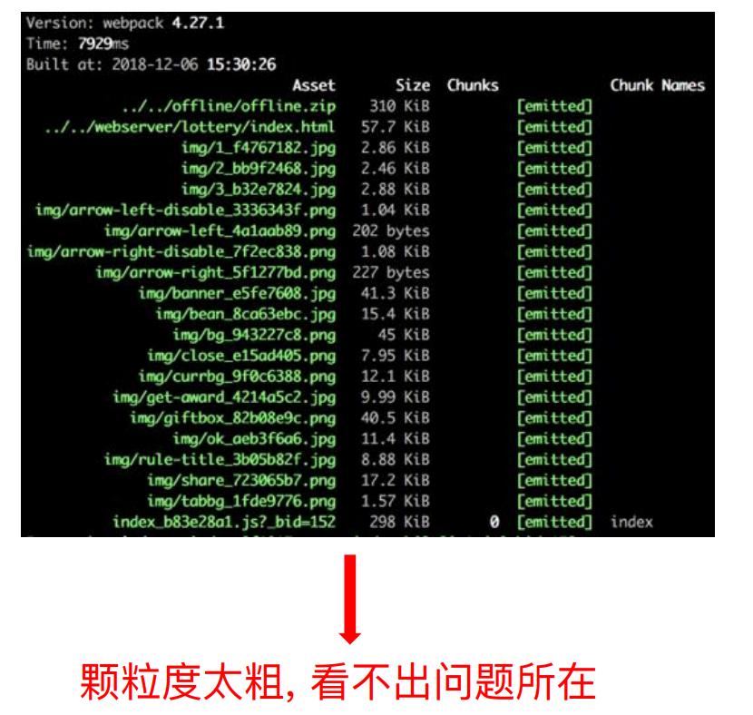
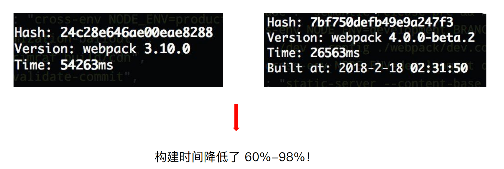

# webpack 构建速度和体积优化策略

## 初级分析：

### 使用 webpack 内置的 stats

stats: 构建的统计信息

package.json 中使用 stats:

```json
"script":{
  "build:stats": "webpack --config webpack.prod.js --json > stats.json",
}
```

Node.js 中使用



## 速度分析：

### 使用 speed-measure-webpack-plugin

代码示例 可以看到每个 loader 和插件执行耗时


速度分析插件作用

- 分析整个打包总耗时
- 每个插件和loader的耗时情况

## 体积分析

### webpack-bundle-analyzer 分析体积

构建完成后会在 8888 端口展示大小


## 可以分析哪些问题？

- 依赖的第三方模块文件大小

- 业务里面的组件代码大小


## 优化思路

### 使用高版本的 webpack 和 Node.js



使用 webpack4/5：优化原因

- V8 带来的优化（for of 替代 forEach、Map 和 Set 替代 Object、includes 替代 indexOf）

- 默认使用更快的 md4 hash 算法
- webpacks AST 可以直接从 loader 传递给 AST，减少解析时间
- 使用字符串方法替代正则表达式

 

### 多进程/多实例构建：

资源并行解析可选方案


#### 使用 HappyPack 解析资源

- 原理：每次 webapck 解析一个模块，HappyPack 会将它及它的依赖分配给 worker 线程中

```js
exports.plugins = {
  new HappyPack({
  	id:'jsx',
  	threads:4,
  	loaders:['label-loader']
	})
  new HappyPack({
    id:'styles',
    threads:2,
    loaders:['style-loader','css-loader','less-loader']
  })
}
```


#### 使用 thread-loader 解析资源

原理：每次 webpack 解析一个模块，threadloader 会将它及它的依赖分配给 worker 线程中

```js
module.exports = wmp.warp({
  entry:entry,
  output:{
    path:path.join(__dirname,'dist'),
    filname: '[name]_[chunkhash:8].js'
  },
  mode:'production',
  module:{
    rules:[
      {
        test:/.js$/,
        use:[
          {
            loader:'thread-loader',
            options:{
              worker:3
            }
          },
          'babler-loader'
        ]
      }
    ]
  }
})
```

 

#### 并行压缩:

方法一：使用 parallel-uglify-plugin 插件

```js
const ParallelUglifyPlugin = require('webpack-parallel-uglify-plugin')
module.exports = {
	plugins:[
    new ParallelUglifyPlugin({
      uglifyJS:{
        out:{
          beautify:false,
          comments:false
        },
        compress:{
          warning:false,
          drop_console:true,
          collapse_vars:true,
          reduce_vars:true
        }
      },
    })
  ]
}


```


方法二：uglifyjs-webpack-plugin 开启 parallel 参数

```js
module.exports = {
	plugins:[
    new UglifyJsPlugin({
      uglifyOptions:{
        // ...
      },
      parallel:true
    })
  ]
}

```

方法三：terser-webpack-plugin 开启 parallel 参数

```js
const TerserPlugin = require('terser-webpack-plugin');
module.exports ={
  optimization:{
    minimizer:[
      new TerserPlugin({
        parallel:4
      })
    ]
  }
}
```


## 分包

### 设置 Externals

- 思路：将 react、react-dom 基础包通过 cdn 引入，不打入 bundle 中

- 方法：使用 html-webpack-externalsplugin

```js
const HtmlWebpackExternalsPlugin = require('html-webpack-externals-plugin');
module.exports = {
  plugins: [
       new HtmlWebpackExternalsPlugin({
            externals: [
              {
                module: 'react',
                entry: 'https://11.url.cn/now/lib/16.2.0/react.min.js',
                global: 'React',
              },
              {
                module: 'react-dom',
                entry: 'https://11.url.cn/now/lib/16.2.0/react-dom.min.js',
                global: 'ReactDOM',
              },
            ]
      }),
  ]
}
```


### 使用 DLLPlugin 进行分包

进一步分包：预编译资源模块。

思路：将 react、react-dom、redux、react-redux基础包和业务基础包打包成一个文件

方法：

1. 使用 DLLPlugin 进行分包，DllReferencePlugin 对 manifest.json 引用

```js

const path = require('path');
const webpack = require('webpack');

module.exports = {
    entry: {
        library: [
            'react',
            'react-dom'
        ]
    },
    output: {
        filename: '[name]_[chunkhash].dll.js',
        path: path.join(__dirname, 'build/library'),
        library: '[name]'
    },
    plugins: [
        new webpack.DllPlugin({
            name: '[name]_[hash]',
            path: path.join(__dirname, 'build/library/[name].json')
        })
    ]
};
```

2. 使用 DllReferencePlugin 引用 manifest.json

   在 webpack.config.js 引入

```js
module.exports = {
  plugins:[
      new webpack.DllReferencePlugin({
            manifest: require('./build/library/library.json')
      })
  ]
}
```

3. 引入效果


## 缓存

目的：提升二次构建速度

缓存思路：

- babel-loader 开启缓存 
- terser-webpack-plugin 开启缓存 ：https://webpack.docschina.org/plugins/terser-webpack-plugin/
- 使用 cache-loader 或者 hard-source-webpack-plugin


## 缩小构建目标

目的：尽可能的少构建模块

比如 babel-loader 不解析 node_modules

```js
module.exports = {
  module:{
    rules:[
      {
        test:/\.js$/,
        loader:'happypack/loader',
        exclude:'node_modules'
      }
    ]
  }
}
```

## 减少文件搜索范围

- 优化 resolve.modules 配置（减少模块搜索层级）
- 优化 resolve.mainFields 配置
- 优化 resolve.extensions 配置
- 合理使用 alias

## 图片压缩

要求：基于 Node 库的 imagemin 或者 tinypng API

使用：配置 image-webpack-loader

#### Imagemin的优点分析

- 有很多定制选项
- 可以引入更多第三方优化插件，例如pngquant
- 可以处理多种图片格式

#### Imagemin的压缩原理

- pngquant: 是一款PNG压缩器，通过将图像转换为具有alpha通道（通常比24/32位PNG 文件小60-80％）的更高效的8位PNG格式，可显著减小文件大小。
- pngcrush:其主要目的是通过尝试不同的压缩级别和PNG过滤方法来降低PNG IDAT数据 流的大小。 
- optipng:其设计灵感来自于pngcrush。optipng可将图像文件重新压缩为更小尺寸，而不 会丢失任何信息。
- tinypng:也是将24位png文件转化为更小有索引的8位图片，同时所有非必要的metadata 也会被剥离掉


## 无用的 CSS 如何删除掉

- PurifyCSS: 遍历代码，识别已经用到的 CSS class
- uncss: HTML 需要通过 jsdom 加载，所有的样式通过PostCSS解析，通过 document.querySelector 来识别在 html 文件里面不存在的选择器

在 webpack 中如何使用 PurifyCSS?

- 使用 purgecss-webpack-plugin · https://github.com/FullHuman/purgecss-webpack-plugin
- 和 mini-css-extract-plugin 配合使用

```js
const path = require('path');
const glob = require('glob');
const MiniCssExtractPlugin = require('mini-css-extract-plugin');
const PurgecssPlugin = require('purgecss-webpack-plugin');
const PATHS = {
	src: path.jon(__dirname,'src')
}
module.exports = {
  module:{
    rules:[
      {
        test:/\.css$/.
        use:[
        	MiniCssExtratPlguin.loader,
        	"css-loader"
        ]
      }
    ]
  },
  plugins:[
    new MiniExtractPlugin({
      filename:"[name].css"
    }),
    new PurgecssPlugin({
      paths:glob.sync(`$PATHS.src/**/*`,{nodir:true})
    })
  ]
}
```

## 构建体积优化：动态 Polyfill


babel-polyfill 打包后体积：88.49k，占比 29.6%

Promise 的浏览器支持情况

:


### 动态polyfill方案：


### Polyfill Service 原理

每次打开页面，浏览器都会向 Polyfill Service 发送请求，Polyfill Service 识别 User Agent，下发不同的 Polyfill，做到按需加载 Polyfill 的效果。


### 如何使用动态 Polyfill service

- polyfill.io 官方提供的服务

- 基于官方自建 polyfill 服务： //huayang.qq.com/polyfill_service/v2/polyfill.min.js?unknown=polyfill&features=Promise,Map,Set


## 体积优化策略总结

- scope hoisting
- tree shaking
- 公共资源分离
- 图片压缩
- 动态polyfill

