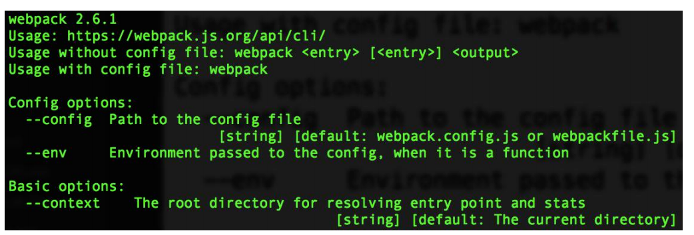
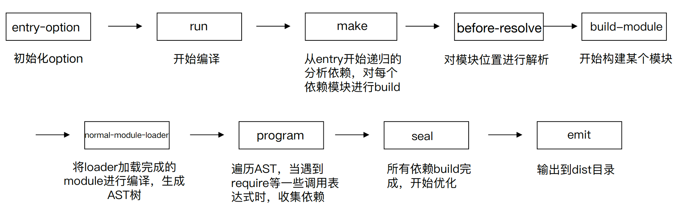
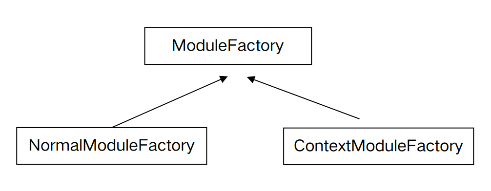

## 开始：从 webpack 命令行说起

通过 npm scripts 运行 webpack

- 开发环境 npm run dev
- 生产环境 npm run build

通过webpack直接运行：webpack entry.js bundle.js

这个过程发生了什么？

### 查找 webpack 入口文件

- 在命令行运行以上命令后，npm会让命令行工具进入node_modules\.bin 目录 查找是否存在 webpack.sh 或者 webpack.cmd 文件，如果存在，就执行，不 存在，就抛出错误。
- 实际的入口文件是：node_modules\webpack\bin\webpack.js

### 分析 webpack 的入口文件：webpack.js 

```js
process.exitCode = 0; 																				// 1、正常执行返回
const runCommand = (command,args)=>{/**...**/}; 							// 2、运行某个命令
cosnt isInstalled = packageName => {/**...**/};								// 3、判断某个包是否安装
const CLIs = [/*...*/];																				// 4、webpack可用的cli ：webpack-cli和webpack-command
const installedClis = CLIs.filter(cli=>cli.installed);				// 5、判断两个cli是否安装了
if(installedClis.length ===0){/*...*/}else if(installClis.length===1){/*...*/}else{/*...*/}
																															// 6、根据安装的数量进行处理
```

### 启动后的结果 

webpack 最终找到 webpack-cli (webpack-command) 这个 npm 包，并且 执行 CLI


### webpack-cli 做的事情

- 引入 yargs，对命令行进行定制
- 分析命令行参数，对各个参数进行转换，组成编译配置项
- 引用webpack，根据配置项进行编译和构建

### 从NON_COMPILATION_CMD分析出不需要编译的命令

webpack-cli 处理不需要经过编译的命令

```js
const { NON_COMPILATION_ARGS } = require("./utils/constants");
const NON_COMPILATION_CMD = process.argv.find(arg => {
	if (arg === "serve") {
  	global.process.argv = global.process.argv.filter(a => a !== "serve");
  	process.argv = global.process.argv;
  }
  return NON_COMPILATION_ARGS.find(a => a === arg);
});
if (NON_COMPILATION_CMD) {
	return require("./utils/prompt-command")(NON_COMPILATION_CMD, ...process.argv);
}
```

### NON_COMPILATION_ARGS的内容

webpack-cli 提供的不需要编译的命令

```js
const NON_COMPILATION_ARGS = [ 
  "init", //创建一份 webpack 配置文件
  "migrate", //进行 webpack 版本迁移
  "add", //往 webpack 配置文件中增加属性
  "remove", //往 webpack 配置文件中删除属性
  "serve", //运行 webpack-serve
  "generate-loader", //生成 webpack loader 代码
  "generate-plugin", //生成 webpack plugin 代码
  "info” //返回与本地环境相关的一些信息
];
```

### 命令行工具包 yargs 介绍

- 提供命令和分组参数
- 动态生成 help 帮助信息
- 

### webpack-cli 使用 args 分析

参数分组 (config/config-args.js)，将命令划分为9类： ·

- Config options: 配置相关参数(文件名称、运行环境等) 
- Basic options: 基础参数(entry设置、debug模式设置watch监听设置、devtool设置) 
- Module options: 模块参数，给 loader 设置扩展 
- Output options: 输出参数(输出路径、输出文件名称) 
- Advanced options: 高级用法(记录设置、缓存设置、监听频率、bail等) 
- Resolving options: 解析参数(alias 和 解析的文件后缀设置) 
- Optimizing options: 优化参数 
- Stats options: 统计参数 
- options: 通用参数(帮助命令、版本信息等)

### webpack-cli 执行的结果

- webpack-cli对配置文件和命令行参数进行转换最终生成配置选项参数 options

- 最终会根据配置参数实例化 webpack 对象，然后执行构建流程


## Webpack 的本质

Webpack可以将其理解是一种基于事件流的编程范例，一系列的插件运行。

### 先看一段代码

核心对象 Compiler 继承 Tapable

```js
class Compiler extends Tapable {
	// ... 
}
```

核心对象 Compilation 继承 Tapable

```js
class Compilation extends Tapable {
	// ... 
}
```

### Tapable 是什么？

Tapable 是一个类似于 Node.js 的 EventEmitter 的库, 主要是控制钩子函数的发布 与订阅,控制着 webpack 的插件系统。

Tapable库暴露了很多 Hook（钩子）类，为插件提供挂载的钩子。

```js
const {
	SyncHook, //同步钩子
  SyncBailHook, //同步熔断钩子
  SyncWaterfallHook, //同步流水钩子
  SyncLoopHook, //同步循环钩子
  AsyncParallelHook, //异步并发钩子
  AsyncParallelBailHook, //异步并发熔断钩子
  AsyncSeriesHook, //异步串行钩子
  AsyncSeriesBailHook, //异步串行熔断钩子
  AsyncSeriesWaterfallHook //异步串行流水钩子
} = require("tapable");
```

### Tapable hooks 类型

| type          | function                                                |
| ------------- | ------------------------------------------------------- |
| Hook          | 所以钩子的后缀                                          |
| waterfall     | 同步方法，但是他会传递给下一个函数                      |
| Bail          | 熔断：当函数有任何返回值，就会在当前执行函数停止        |
| Loop          | 监听函数返回true表示继续循环，返回undefined表示结束循环 |
| Sync          | 同步方法                                                |
| AsyncSeries   | 异步串行执行的钩子                                      |
| AsyncParallel | 异步并行执行的钩子                                      |


### Tapable 的使用 -new Hook 新建钩子

- Tapable 暴露出来的都是类方法，new 一个类方法获得我们需要的钩子
- class 接受数组参数 options ，非必传。类方法会根据传参，接受同样数量的参数。` const hook1 = new SyncHook(["arg1", "arg2", "arg3"]);`

### Tapable 的使用-钩子的绑定与执行

Tabpack 提供了同步&异步绑定钩子的方法，并且他们都有绑定事件和执行事件对 应的方法。

| Async*                         | Sync*      |
| ------------------------------ | ---------- |
| 绑定：tapAsync/tap Promise/tap | 绑定：tap  |
| 执行：callAsync/promise        | 执行：call |

### Tapable 的使用-hook 基本用法示例

```js
const hook1 = new SyncHook(["arg1", "arg2", "arg3"]);
//绑定事件到webapck事件流
hook1.tap('hook1', (arg1, arg2, arg3) => console.log(arg1, arg2, arg3)) //1,2,3
//执行绑定的事件
hook1.call(1,2,3)
```

定义一个 Car 方法，在内部 hooks 上新建钩子。分别是同步钩子 accelerate、 brake（ accelerate 接受一个参数）、异步钩子 calculateRoutes。

使用钩子对应的绑定和执行方法

calculateRoutes 使用 tapPromise 可以返回一个 promise 对象

```js
const {
    SyncHook,
    AsyncSeriesHook
} = require('tapable');

class Car {
    constructor() {
        this.hooks = {
  					// 加速
            accelerate: new SyncHook(['newspeed']),
            // 刹车
            brake: new SyncHook(),
            // 计算路径
            calculateRoutes: new AsyncSeriesHook(["source", "target", "routesList"])
        }
    }
}


const myCar = new Car();
 
//绑定同步钩子
myCar.hooks.brake.tap("WarningLampPlugin", () => console.log('WarningLampPlugin'));
 
//绑定同步钩子 并传参
myCar.hooks.accelerate.tap("LoggerPlugin", newSpeed => console.log(`Accelerating to ${newSpeed}`));
 
//绑定一个异步Promise钩子
myCar.hooks.calculateRoutes.tapPromise("calculateRoutes tapPromise", (source, target, routesList, callback) => {
    // return a promise
    return new Promise((resolve,reject)=>{
        setTimeout(()=>{
            console.log(`tapPromise to ${source} ${target} ${routesList}`)
            resolve();
        },1000)
    })
});


myCar.hooks.brake.call();
myCar.hooks.accelerate.call(10);
 
console.time('cost');
 
//执行异步钩子
myCar.hooks.calculateRoutes.promise('Async', 'hook', 'demo').then(() => {
    console.timeEnd('cost');
}, err => {
    console.error(err);
    console.timeEnd('cost');
});
```


### Tapable 是如何和 webpack 联系起来的？

```js
if (Array.isArray(options)) {
	compiler = new MultiCompiler(options.map(options => webpack(options)));
} else if (typeof options === "object") {
  // 初始化参数
  options = new WebpackOptionsDefaulter().process(options);
  // 创建一个complier对象
  compiler = new Compiler(options.context);
  compiler.options = options;
  // 创建一个插件 插件有一个apply方法，传入compiler
  new NodeEnvironmentPlugin().apply(compiler);
  // 又没有plugins，遍历
  if (options.plugins && Array.isArray(options.plugins)) {
    for (const plugin of options.plugins) {
      if (typeof plugin === "function") {
        // 执行plugin
     		plugin.call(compiler, compiler);
      } else {
      	plugin.apply(compiler);
      }
    }
  }
  compiler.hooks.environment.call();
  compiler.hooks.afterEnvironment.call();
  // 将内部插件注入
  compiler.options = new WebpackOptionsApply().process(options, compiler);
}
```


### 模拟内部插件机制

模拟compiler.js

```js
const {
    SyncHook,
    AsyncSeriesHook
} = require('tapable');

module.exports = class Compiler {
    constructor() {
        this.hooks = {
            accelerate: new SyncHook(['newspeed']), // 同步
            brake: new SyncHook(), // 同步
            calculateRoutes: new AsyncSeriesHook(["source", "target", "routesList"]) // 异步
        }
    }
    // 入口
    run(){
        this.accelerate(10)
        this.break()
        this.calculateRoutes('Async', 'hook', 'demo')
    }
    accelerate(speed) {
        this.hooks.accelerate.call(speed);
    }
    break() {
        this.hooks.brake.call();
    }
    calculateRoutes() {
        this.hooks.calculateRoutes.promise(...arguments).then(() => {
        }, err => {
            console.error(err);
        });
    }
}
```

插件 my-plugin.js

```js
const Compiler = require('./Compiler')
 
class MyPlugin{
    constructor() {
 
    }
    apply(compiler){
        // 监听了这些hooks，正常webpack的compiler提供了一堆hooks，只需要根据业务去做监听
        compiler.hooks.brake.tap("WarningLampPlugin", () => console.log('WarningLampPlugin'));
        compiler.hooks.accelerate.tap("LoggerPlugin", newSpeed => console.log(`Accelerating to ${newSpeed}`));
        compiler.hooks.calculateRoutes.tapPromise("calculateRoutes tapAsync", (source, target, routesList) => {
            return new Promise((resolve,reject)=>{
                setTimeout(()=>{
                    console.log(`tapPromise to ${source} ${target} ${routesList}`)
                    resolve();
                },1000)
            });
        });
    }
}
 
const myPlugin = new MyPlugin();

// 模拟:webpack配置文件的注册插件
const options = {
    plugins: [myPlugin]
}


// webpack内部拿到注册的插件后，会执行插件的apply方法，内部会注册一堆钩子事件，最后通过run去执行所有注册的钩子
const compiler = new Compiler();

for (const plugin of options.plugins) {
    if (typeof plugin === "function") {
        plugin.call(compiler, compiler);
    } else {
        plugin.apply(compiler);
    }
}
compiler.run();
```


## Webpack 流程篇

### webpack的编译都按照下面的钩子调用顺序执行



### WebpackOptionsApply

将所有的配置 options 参数转换成 webpack 内部插件

使用默认插件列表

举例： 

- output.library -> LibraryTemplatePlugin 
- externals -> ExternalsPlugin 
- devtool -> EvalDevtoolModulePlugin, SourceMapDevToolPlugin 
- AMDPlugin, CommonJsPlugin 
- RemoveEmptyChunksPlugin

### Compiler hooks

流程相关： 

- (before-)run 
- (before-/after-)compile 
- make 
- (after-)emit
- ·done

监听相关： 

- watch-run 
- watch-close

### Compilation

Compiler 调用 Compilation 生命周期方法 

- addEntry -> addModuleChain 
- finish (上报模块错误) 
- seal

### ModuleFactory



### 实现一个简单的webpack

#### Compiler.js

```js

const fs = require('fs');
const path = require('path');
const { getAST, getDependencis, transform } = require('./parser');


module.exports = class Compiler {
    constructor(options) {
        const { entry, output } = options;
        this.entry = entry;
        this.output = output;
        this.modules = [];
    }

    run() {
        const entryModule = this.buildModule(this.entry, true);
        this.modules.push(entryModule);
        this.modules.map((_module) => {
            _module.dependencies.map((dependency) => {
                this.modules.push(this.buildModule(dependency));
            });
        });
        this.emitFiles();
    }

    buildModule(filename, isEntry) {
        let ast;
        if (isEntry) {
            ast = getAST(filename);
        } else {
            let absolutePath = path.join(process.cwd(), './src', filename);
            ast = getAST(absolutePath);
        }

        return {
          filename,
          dependencies: getDependencis(ast),
          transformCode: transform(ast)
        };
    }

    emitFiles() { 
        const outputPath = path.join(this.output.path, this.output.filename);
        let modules = '';
        this.modules.map((_module) => {
            modules += `'${ _module.filename }': function (require, module, exports) { ${ _module.transformCode } },`
        });
        
        const bundle = `
            (function(modules) {
                function require(fileName) {
                    const fn = modules[fileName];
        
                    const module = { exports : {} };
        
                    fn(require, module, module.exports);
        
                    return module.exports;
                }

                require('${this.entry}');
            })({${modules}})
        `;
    
        fs.writeFileSync(outputPath, bundle, 'utf-8');
    }
};

```

