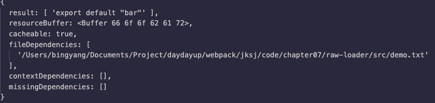

## loader

### 一个最简单的 loader 代码结构

定义：loader 只是一个导出为函数的 JavaScript 模块

```js
module.exports = function(source) {
	return source;
};
```

### 多 Loader 时的执行顺序

多个 Loader 串行执行

顺序从后到前

```js
module.exports = {
  entry: './src/index.js', output: {
  filename: 'bundle.js', path: path.resolve(__dirname, 'dist')
  }, 
  + module: {
    + rules: [
      + {
        + test: /\.less$/, 
        + use: [
          + 'style-loader',
          + 'css-loader',
          + 'less-loader'
        + ]
      + }
    + ]
  + }
};
```

### 函数组合的两种情况

- Unix 中的 pipline

- Compose(webpack采取的是这种)

  ```js
  compose = (f, g) => (...args) => f(g(...args));
  ```

  

### 通过一个例子验证 loader 的执行顺序

a-loader.js:

```js
module.exports = function(source) {
	console.log ('loader a is executed');
  return source;
};
```

b-loader.js

```js
module.exports = function(source) {
  console.log ('loader b is executed');
  return source;
};
```


### loader-runner

#### 介绍

定义：loader-runner 允许你在不安装 webpack 的情 况下运行 loaders

作用：

- 作为webpack的依赖，webpack中使用它执行loader
- 进行loader的开发和调试

#### loader-runner 的使用

```js
import { runLoaders } from "loader-runner";
runLoaders({
  resource: “/abs/path/to/file.txt?query”, // String: 资源的绝对路径(可以增加查询字符串)
  loaders: [“/abs/path/to/loader.js?query”], // String[]: loader 的绝对路径(可以增加查询字符串)
  context: { minimize: true }, // 基础上下文之外的额外 loader 上下文
  readResource: fs.readFile.bind(fs) // 读取资源的函数
}, function(err, result) {
  // err: Error?
  // result.result: Buffer | String
})
```

### 开发一个 raw-loader

```js
// src/raw-loader.js:
module.exports = function(source) {
  const json = JSON.stringify(source)
    .replace("foo", "")
    .replace(/\u2028/g, ‘\\u2028 ' ) // 为了安全起见, ES6模板字符串的问题
    .replace(/\u2029/g, '\\u2029');
  return `export default ${json}`;
};
```

```js
// src/demo.txt
foobar
```

使用 loader-runner 调试 loader

```js
// run-loader.js:
const fs = require("fs");
const path = require("path");
const { runLoaders } = require("loader-runner");
runLoaders({
  resource: "./demo.txt",
  loaders: [path.resolve(__dirname, "./loaders/rawloader")],
  readResource: fs.readFile.bind(fs)
},(err, result) => {
  err ? console.error(err) : console.log(result)
})
```

结果



### loader 的参数获取

通过 loader-utils 的 getOptions 方法获取 

```js
const loaderUtils = require("loader-utils"); 
module.exports = function(content) {
  const { name } = loaderUtils.getOptions(this);
};
```

### loader 异常处理

- loader 内直接通过 throw 抛出

- 通过 this.callback 传递错误

  ```js
  this.callback(
    err: Error | null, 
    content: string | Buffer,
    sourceMap?: SourceMap,
    meta?: any
  );
  ```

### loader 的异步处理

通过 this.async 来返回一个异步函数

- ·第一个参数是 Error，第二个参数是处理的结果

```js
module.exports = function(input) {
  const callback = this.async();
  // No callback -> return synchronous results
  // if (callback) { ... }
  setTimeout(()=>{
	  callback(null, input + input);
  },500)
};
```

### 在 loader 中使用缓存

webpack 中默认开启 loader 缓存

- 可以使用 this.cacheable(false) 关掉缓存

缓存条件： loader 的结果在相同的输入下有确定的输出 

- 有依赖的 loader 无法使用缓存

### loader 如何进行文件输出？

通过 this.emitFile 进行文件写入

```js
const loaderUtils = require("loader-utils");
module.exports = function(content) {
  const url = loaderUtils.interpolateName(this, "[hash].[ext]", { content });
  this.emitFile(url, content);
  const path = `__webpack_public_path__ + ${JSON.stringify(url)};`;
  return `export default ${path}`;
};
```

### 实战开发一个自动合成雪碧图的 loader

支持的语法

```css
background: url('a.png?__sprite');
background: url('b.png?__sprite');
```

转换成

```css
background: url('sprite.png');
```

#### 准备知识：如何将两张图片合成一张图片？

使用 spritesmith (https://www.npmjs.com/package/spritesmith)

spritesmith 使用示例

```js
const sprites = ['./images/1.jpg', './images/2.jpg'];
Spritesmith.run({src: sprites}, function handleResult (err, result) {
  result.image;
  result.coordinates;
  result.properties;
});
```

## Plugins

### 插件的运行环境

插件没有像 loader 那样的独立运行环境

只能在 webpack 里面运行

### 插件的基本结构和使用

```js
class MyPlugin {
  apply(compiler) {
    compiler.hooks.done.tap(' My Plugin', (
    	stats /* stats is passed as argument when done hook is tapped. */
    ) => {
   	 	console.log('Hello World!');
    });
  }
}
module.exports = MyPlugin;
```

```js
plugins: [ new MyPlugin() ]
```

### 搭建插件的运行环境

```js
const path = require("path");
const DemoPlugin = require("./plugins/demo-plugin.js");
const PATHS = {
  lib: path.join(__dirname, "app", "shake.js"), build: path.join(__dirname, "build"), 
};
module.exports = {
  entry: {
    lib: PATHS.lib
  },
  output: {
  	path: PATHS.build, filename: "[name].js"
  },
  plugins: [
    new DemoPlugin()
  ], 
};
```

### 开发一个最简单的插件

src/demo-plugin.js

```js
module.exports = class DemoPlugin {
  constructor(options) {
 		this.options = options;
  }
  apply() {
  	console.log("apply", this.options);
  }
};
```

加入到 webpack 配置中

```js
module.exports = {
	 plugins: [new DemoPlugin({ name: "demo" })]
};
```

### 插件中如何获取传递的参数？

通过插件的构造函数进行获取

```js
module.exports = class MyPlugin {
  constructor(options) {
  	this.options = options;
  }
  apply() {
  	console.log("apply", this.options);
  }
};
```

### 插件的错误处理

参数校验阶段可以直接 throw 的方式抛出

```js
 throw new Error(“ Error Message”)
```

通过 compilation 对象的 warnings 和 errors 接收 

```js
compilation.warnings.push("warning"); 
compilation.errors.push("error");
```

### 通过 Compilation 进行文件写入

Compilation 上的 assets 可以用于文件写入

- 可以将 zip 资源包设置到 compilation.assets 对象上

文件写入需要使用 [webpack-sources](https://www.npmjs.com/package/webpack- sources) 

```js
const { RawSource } = require("webpack-sources");
module.exports = class DemoPlugin {
  constructor(options) {
  	this.options = options;
  }
  apply(compiler) {
    const { name } = this.options;
    compiler.plugin("emit", (compilation, cb) => {
      compilation.assets[name] = new RawSource("demo");
      cb();
    });
  }
};
```

### 插件扩展：编写插件的插件

插件自身也可以通过暴露 hooks 的方式进行自身扩展，以 html- webpack-plugin 为例：

- html-webpack-plugin-alter-chunks (Sync) 

- html-webpack-plugin-before-html-generation (Async) 
- html-webpack-plugin-alter-asset-tags (Async)
- html-webpack-plugin-after-html-processing (Async) 
- html-webpack-plugin-after-emit (Async)

### 编写一个压缩构建资源为zip包的插件

要求： 

- 生成的 zip 包文件名称可以通过插件传入 

- 需要使用 compiler 对象上的特地 hooks 进行资源的生成

#### 准备知识：Node.js 里面将文件压缩为 zip 包

使用 [jszip](https://www.npmjs.com/package/jszip)

```js
var zip = new JSZip();
zip.file("Hello.txt", "Hello World\n");
var img = zip.folder("images");
img.file("smile.gif", imgData, {base64: true});
zip.generateAsync({type:"blob"}).then(function(content) {
  // see FileSaver.js
  saveAs(content, "example.zip");
});
```

#### 复习：Compiler 上负责文件生成的 hooks

Hooks 是 emit，是一个异步的 hook (AsyncSeriesHook) 

emit 生成文件阶段，读取的是 compilation.assets 对象的值

- 可以将 zip 资源包设置到 compilation.assets 对象上

#### 实现

plugins/zip-plugin.js

```js
const JSZip = require('jszip');
const path = require('path');
const RawSource = require('webpack-sources').RawSource;
const zip = new JSZip();

module.exports = class ZipPlugin {
    constructor(options) {
        this.options = options;
    }

    apply(compiler) {

        // 文件生产
        compiler.hooks.emit.tapAsync('ZipPlugin', (compilation, callback) => {
            const folder = zip.folder(this.options.filename);

            for (let filename in compilation.assets) {
                const source = compilation.assets[filename].source();
                folder.file(filename, source);
            }

            zip.generateAsync({
                type: 'nodebuffer'
            }).then((content) => {
                const outputPath = path.join(
                    compilation.options.output.path, 
                    this.options.filename + '.zip'
                );

                const outputRelativePath = path.relative(
                    compilation.options.output.path,
                    outputPath
                );
                compilation.assets[outputRelativePath] = new RawSource(content);

                callback();
            });
        });
    }
}
```

webpack.config.js

```js
const path = require('path');
const ZipPlugin = require('./plugins/zip-plugin');

module.exports = {
    entry: './src/index.js',
    output: {
        path: path.join(__dirname, 'dist'),
        filename: 'main.js'
    },
    mode: 'production',
    plugins: [
        new ZipPlugin({
            filename: 'offline'
        })
    ]
}
```

