## 商城技术栈选型

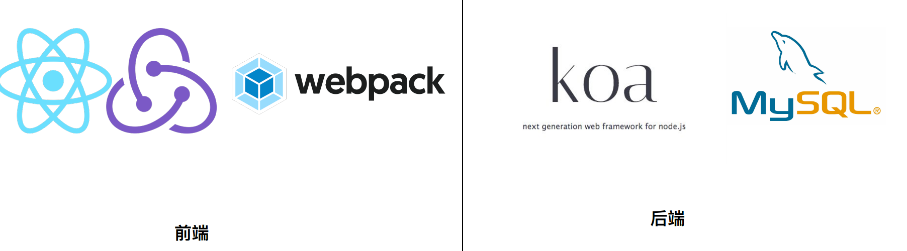

## 商城架构设计

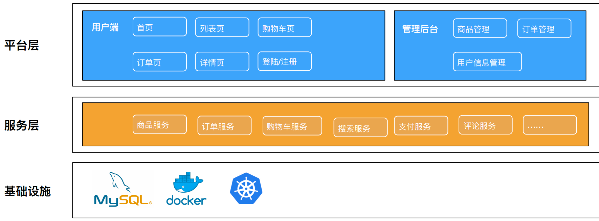

## 商城界⾯ UI 设计与模块拆分

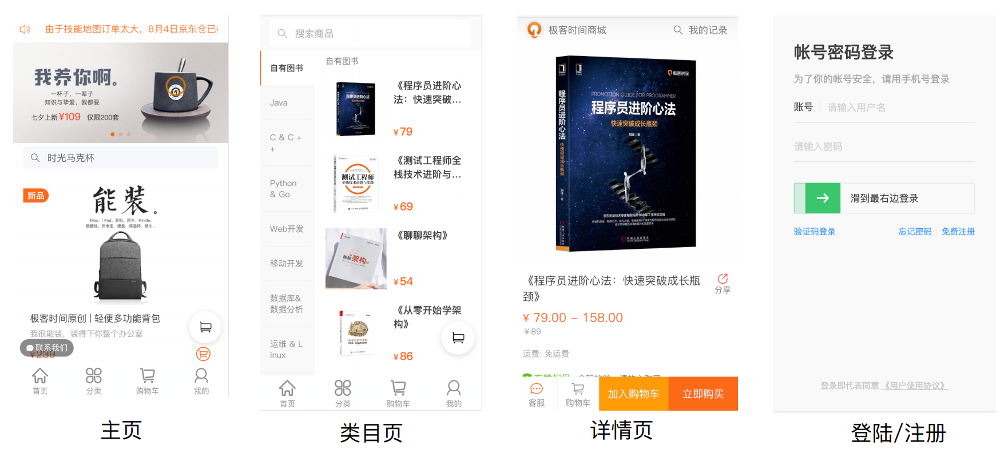

## 前台模块拆分

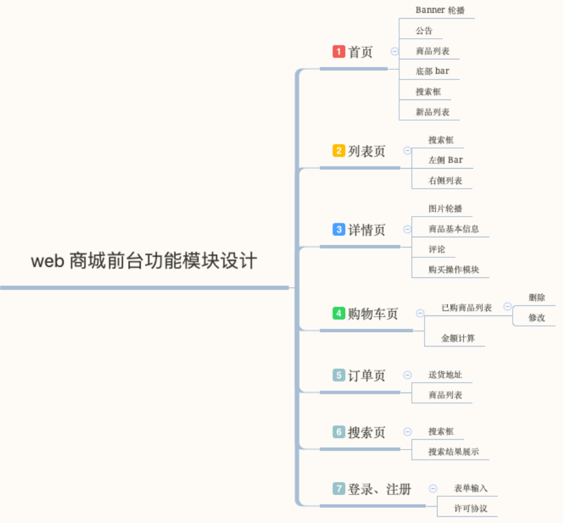

## 后台模块拆分

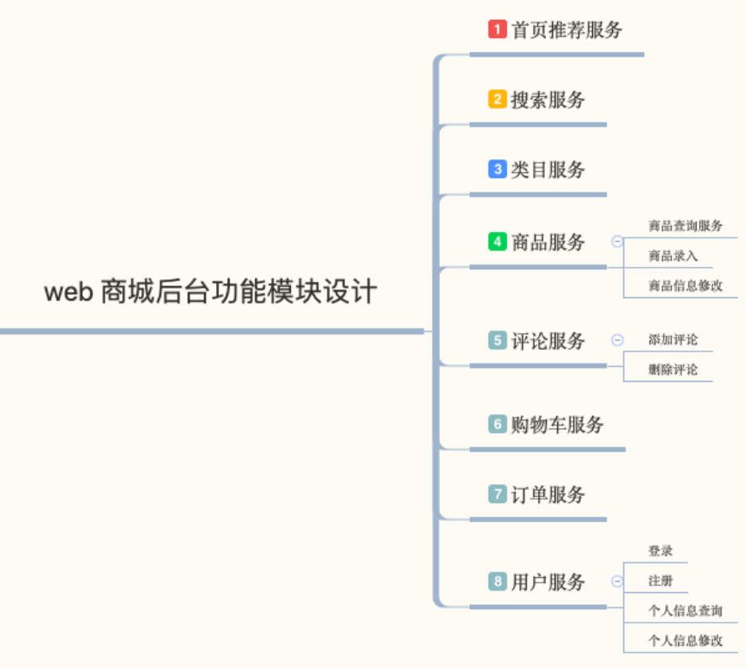

## React 全家桶环境搭建

初始化项⽬ npm init -y 

创建项⽬⽬录

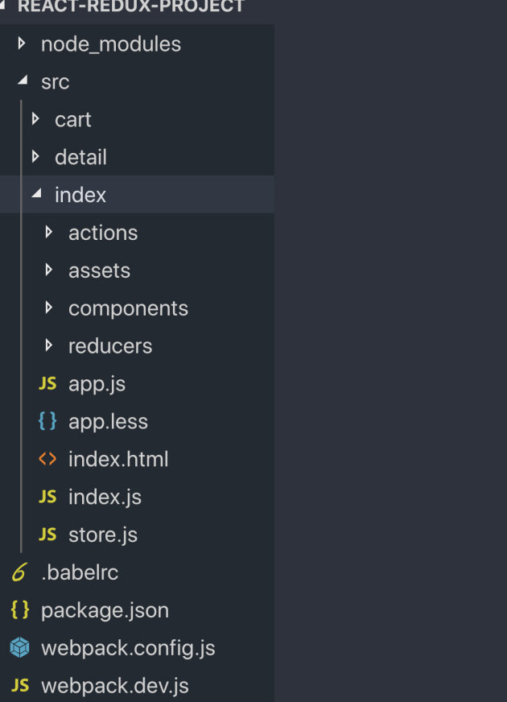

### 安装依赖

- 安装 react、react-dom、redux、react-redux 

  `npm i react react-dom redux react-redux -S`

- 安装 @babel/core `npm i @babel/core -D`
- 安装 geektime-builder-webpack（自己封装好的） `npm i geektime-builder-webpack -D`

### 创建 actions、reducers、store

- actions 和 reducers：src/actions/ 放置所有的actions、src/reducers 放置所有的 reducers
- rootReducer： src/reducers/rootReducer.js 将所有的 reducers 进⾏ Combine
-  使⽤ Provider 传递 store： Store 通过 Provider 传递给容器组件

## 数据库实体设计

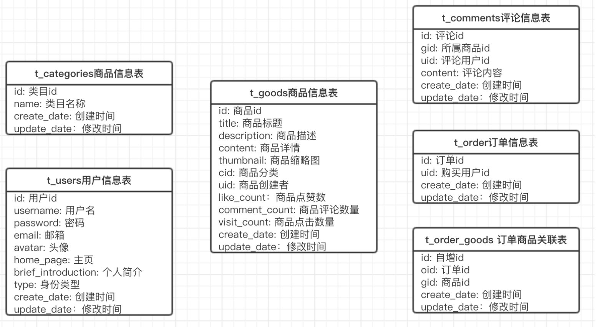

## 编写服务端 API

- 登录注册API
  - ⽤户注册(POST)：/user/register 
  - ⽤户登陆(GET)：/user/login
- 商品 API 
  - 商品列表(GET)：/goods?page=1&per_page=10 
  - 商品详情(GET)： /goods/:id 
  - 修改商品(PUT)： /goods/:id

## 登陆注册模块开发

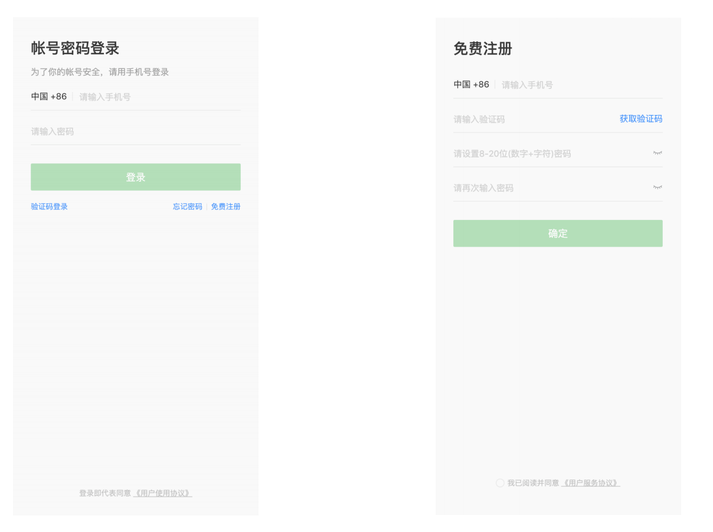

### JSON Web Token ⼯作原理

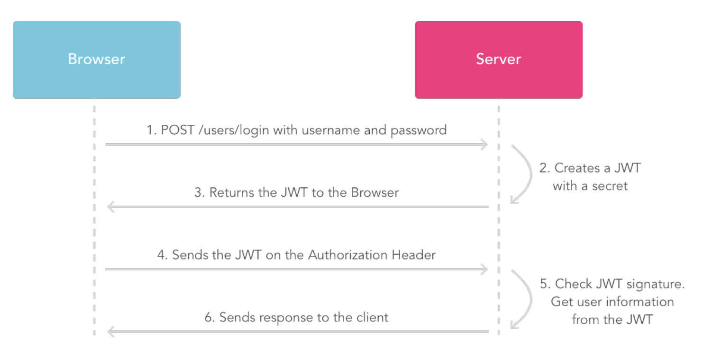

### 登陆注册模块开发 - 注册功能

- 注册 API (POST): http://127.0.0.1:8001/api/v1/user/register 

  `curl -X POST -d "username=test&password=123456&email=test@qq.com" "http://127.0.0.1:8001/api/v1/user/register"`

- 注册截图 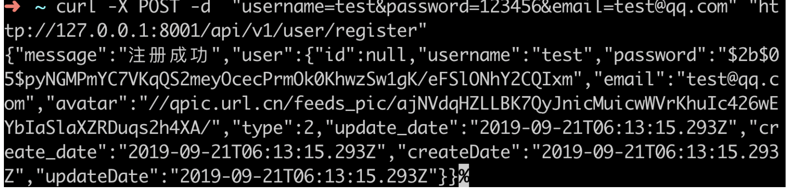

### 登陆注册模块开发 - 登录功能

- 登陆 API (POST): http://127.0.0.1:8001/api/v1/user/login

  `curl -X POST -d "username=test&password=123456" "http://127.0.0.1:8001/api/v1/user/login"`

- 登录截图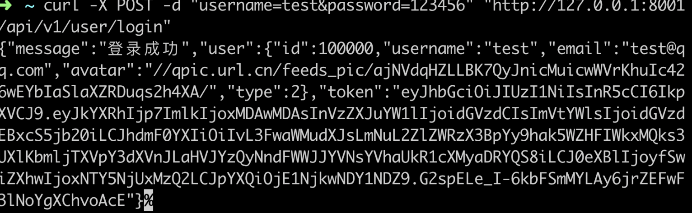

## 商品模块开发

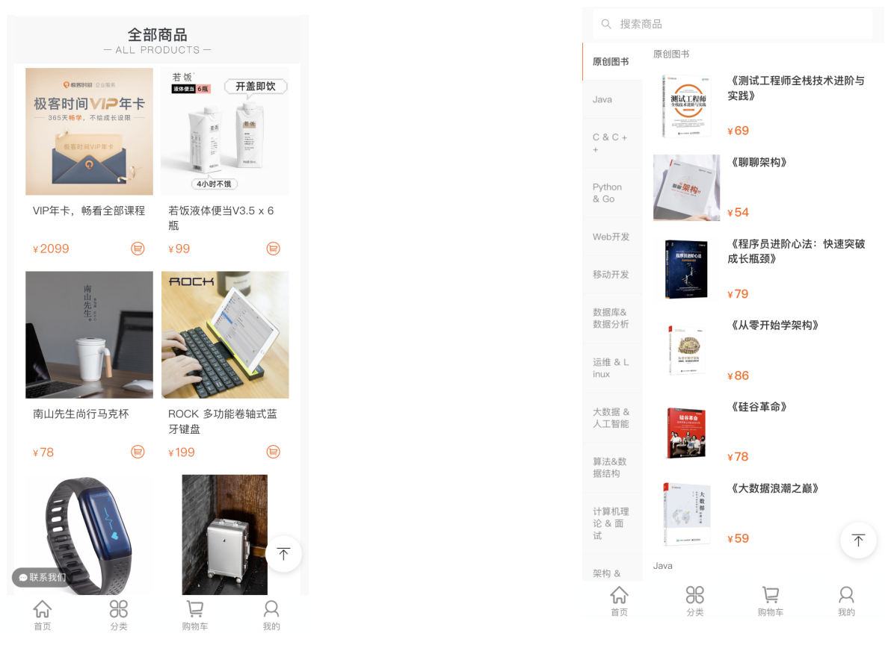

### 商品模块开发 - 创建商品

创建商品 API (POST): http://127.0.0.1:8001/api/v1/goods/new

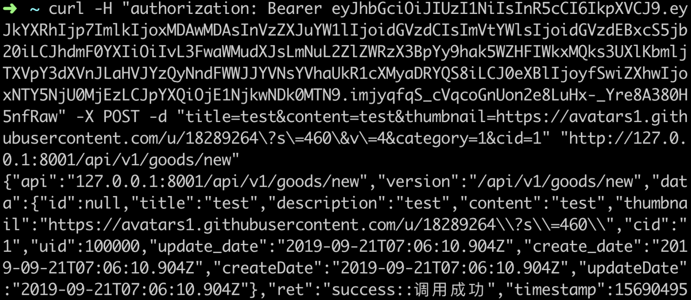

### 商品模块开发 - 获取商品列表

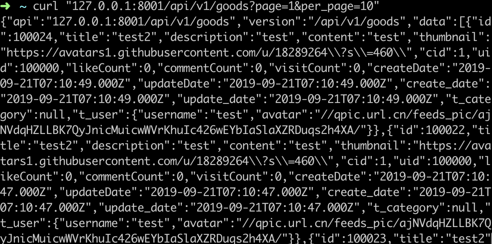

## 订单模块开发

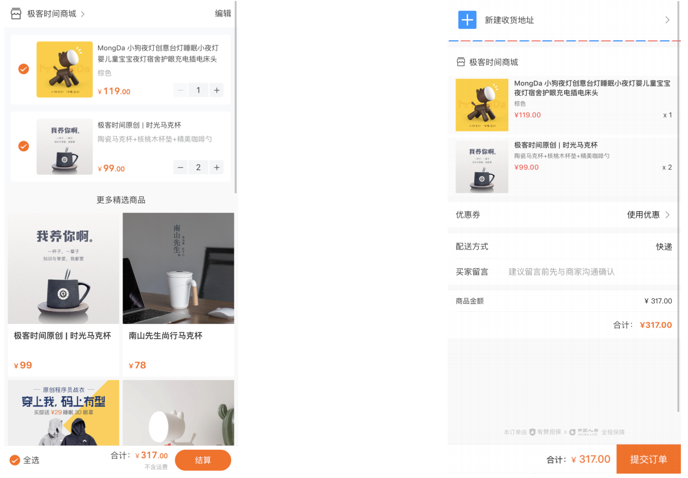

### 订单模块开发 - 创建订单

创建订单 API (POST): http://127.0.0.1:8001/api/v1/order/new

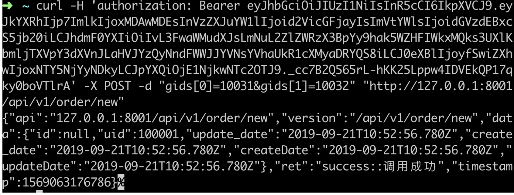

## 谈谈 Web 商城的性能优化策略

### 渲染优化

- · ⾸⻚、列表⻚、详情⻚采⽤ SSR 或者 Native 渲染
- 个⼈中⼼⻚预渲染

### 弱⽹优化

使⽤离线包、PWA 等离线缓存技术

### Webview 优化

打开 Webview 的同时并⾏的加载⻚⾯数据

## 功能开发要点

浏览器端：

- 组件化，组件颗粒度尽可能⼩ 
- 直接复⽤ builder-webpack-geektime 的构建配置，⽆需关注构建脚本

服务端

- MVC 开发⽅式，数据库基于 Sequelize ·
- Rest API ⻛格 
- 采⽤ JWT 进⾏鉴权